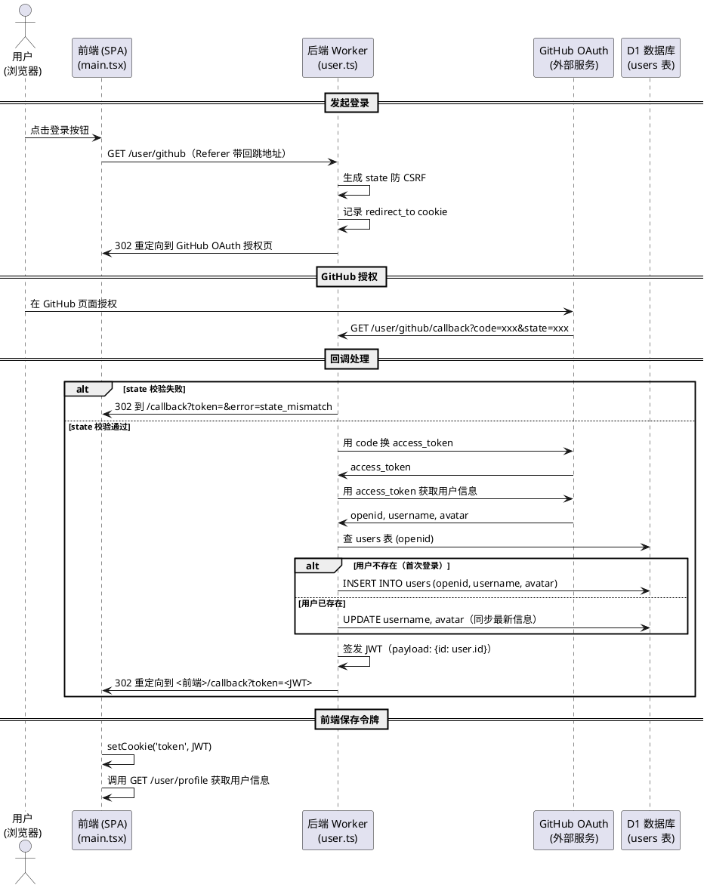
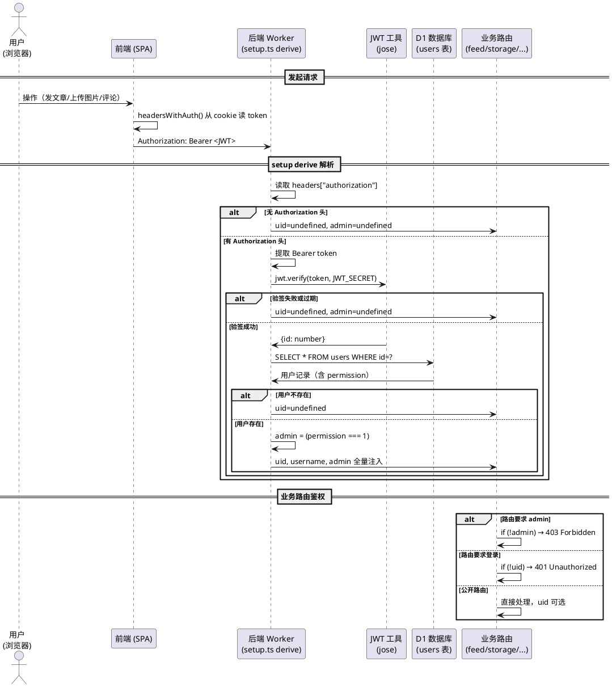
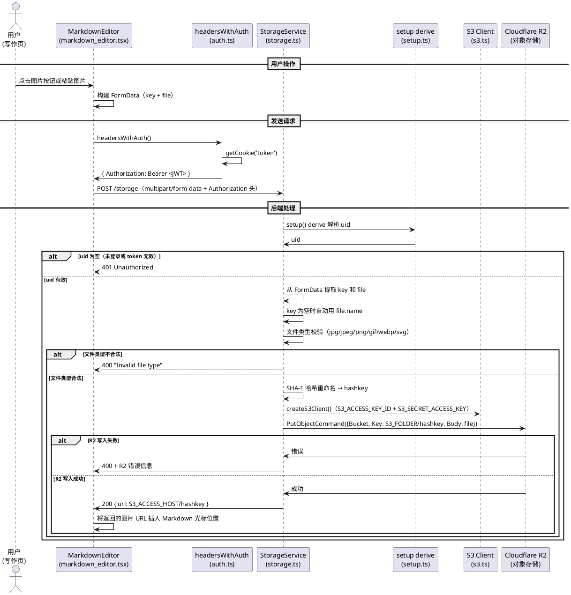
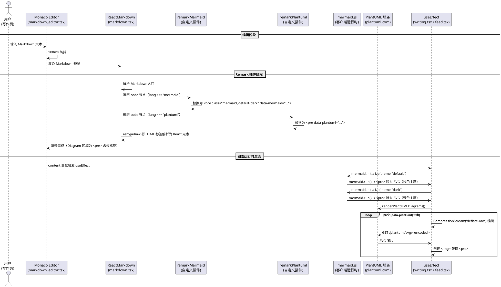

# Rin 博客系统 — 架构文档

> 生成日期：2026-07-12 | 基于分支：dev (86be379)

## 一、项目概览

Rin 是一个基于 **Cloudflare 全家桶**的轻量级个人博客/内容管理平台。单作者模式，支持 Markdown 写作、标签分类、友链管理、评论、说说、RSS/Atom/JSON Feed、天气小部件、音乐播放器等完整博客功能。

| 维度 | 选型 |
|---|---|
| 前端 | React 18 SPA (Vite 5 + TypeScript + Tailwind CSS) |
| 后端 | ElysiaJS on Cloudflare Workers |
| 数据库 | Cloudflare D1 (SQLite，通过 Drizzle ORM 读写) |
| 对象存储 | Cloudflare R2 (兼容 S3 API) |
| 认证 | GitHub OAuth2 + 自签 JWT |
| 部署 | GitHub Actions → Cloudflare Pages (前端) + Workers (后端) |
| 图表 | Mermaid (客户端渲染) + PlantUML (外部服务 SVG) |
| 包管理 | Bun monorepo (Turborepo 编排) |
| 国际化 | i18next (zh-CN / en / ja / zh-TW) |

## 二、系统架构图

```
                        ┌─── Cloudflare Edge ──────────────────────────┐
                        │                                                │
  用户浏览器             │  ┌─────────────┐      ┌──────────────────┐   │
  ──────────────────────►  │  Pages 托管  │      │  Worker 服务      │   │
  (SPA, 动态内容)         │  │ (client/)   │      │  (server/)        │   │
                        │  │ 静态资源     │      │  Elysia + 12 服务  │   │
                        │  └─────────────┘      └──┬───┬───┬───┬──┘   │
                        │                         │   │   │   │       │
                        │                    ┌────┘   │   │   └────┐  │
                        │                    ▼        ▼   ▼        ▼  │
                        │               ┌──────┐ ┌──────┐ ┌─────────┐ │
                        │               │ D1   │ │ R2   │ │ GitHub  │ │
                        │               │(文章 │ │(图片 │ │ OAuth   │ │
                        │               │ 评论)│ │ 缓存)│ │ + JWT   │ │
                        │               └──────┘ └──────┘ └─────────┘ │
                        └────────────────────────────────────────────────┘
```

## 三、后端架构

### 3.1 入口与路由注册

Worker 入口文件 `server/src/_worker.ts` 处理两类事件：

- **`fetch(request, env, ctx)`** — 所有 HTTP 请求。初始化 Drizzle D1 连接、tsyringe 依赖注入容器、创建 Elysia 应用实例并处理请求。
- **`scheduled(event, env, ctx)`** — Cron 定时任务（友链健康检查、RSS Feed 生成）。

所有 12 个服务路由在 `server/src/server.ts` 中通过 `app.use(Service)` 统一注册，各服务作为 Elysia 插件返回，互不耦合。

### 3.2 12 个后端服务

| 服务 | 文件 | 核心端点 | 鉴权 |
|---|---|---|---|
| **UserService** | `services/user.ts` | `GET /user/github`（OAuth 入口）、`/user/github/callback`（回调）、`GET /user/profile` | profile 需登录 |
| **FeedService** | `services/feed.ts` | `GET /feed`（列表+分页）、`POST /feed`（发布）、`GET/POST/DELETE /feed/:id`、搜索、WordPress 导入 | 增删改需 admin |
| **CommentService** | `services/comments.ts` | `GET/POST /feed/comment/:feed`、`DELETE /comment/:id` | 增删需登录 |
| **TagService** | `services/tag.ts` | `GET /tag`（列表）、`GET /tag/:name`（按标签查文章） | 无 |
| **FriendService** | `services/friends.ts` | `GET/POST/PUT/DELETE /friend` + 定时健康检查 | 增删改需 admin |
| **StorageService** | `services/storage.ts` | `POST /storage`（图片上传到 R2） | 需登录 |
| **SEOService** | `services/seo.ts` | `GET /seo/*`（反向代理 R2 中的渲染 HTML） | 无 |
| **RSSService** | `services/rss.ts` | `GET /sub/:name`（提供 RSS/Atom/JSON Feed） | 无 |
| **FaviconService** | `services/favicon.ts` | `GET/POST /favicon`（网站图标管理） | 需 admin |
| **ConfigService** | `services/config.ts` | `GET/POST /config/:type` | 需 admin |
| **AIConfigService** | `services/ai-config.ts` | `GET/POST /ai-config`（AI 摘要配置） | 需 admin |
| **MomentsService** | `services/moments.ts` | `GET/POST/DELETE /moments`（说说动态） | 增删需 admin |
| **WeatherService** | `services/weather.ts` | `GET /weather`（OpenWeatherMap 代理） | 无 |

### 3.3 认证流程

**时序图：用户登录（GitHub OAuth2 → JWT）**



**时序图：业务接口鉴权（setup derive 中间件）**



### 3.4 数据库设计 (D1 / Drizzle ORM)

`server/src/db/schema.ts` 定义全部表结构（SQLite 兼容）：

```
users          — id, username, openid, avatar, permission, created_at, updated_at
feeds          — id, alias, title, summary, ai_summary, content, cover, listed, draft, top, uid, created_at, updated_at
moments        — id, content, uid, created_at, updated_at
comments       — id, feedId, userId, content, created_at, updated_at
friends        — id, name, desc, avatar, url, uid, accepted, health, sort_order, created_at, updated_at
hashtags       — id, name, created_at
feed_hashtags  — feedId, hashtagId, created_at (多对多关联表)
visits         — id, feedId, ip, created_at (PV/UV 统计)
info           — key, value (键值对存储，AI API 密钥等敏感配置)
```

所有时间字段使用 `unixepoch()` 默认值。迁移脚本位于 `server/sql/` 目录，通过 `bun scripts/migrator.ts` 在部署时自动应用。

### 3.5 对象存储 (R2 / S3 兼容)

`server/src/utils/s3.ts` 使用 AWS SDK `@aws-sdk/client-s3` 封装 R2 操作。R2 桶中存储：

| 用途 | 路径模式 | 写入方式 |
|---|---|---|
| 图片上传 | `S3_FOLDER/<sha1>.<ext>` | `POST /storage` 接口 |
| RSS Feed 缓存 | `S3_FOLDER/rss.{xml,json}` | Cron 定时生成 |
| SEO 渲染缓存 | `S3_FOLDER/seo/<path>.html` | Puppeteer 预渲染 |
| 配置文件 | `S3_FOLDER/{cache,server,client}.config.json` | 配置变更时持久化 |
| 网站图标 | `S3_FOLDER/favicon.*` | `POST /favicon` 接口 |

**时序图：图片上传到 R2**



### 3.6 缓存系统

`server/src/utils/cache.ts` 实现了内存 + R2 持久化的双层缓存：

- **PublicCache** — 通用 API 响应缓存（动态管理 published/unpublished 状态）
- **ServerConfig** — 服务端配置（Webhook URL、Cron 设置等）
- **ClientConfig** — 客户端配置（计数器开关、友链申请开关、评论开关等）

所有缓存支持 `get/set/getOrSet/getOrDefault/delete/deletePrefix/deleteSuffix/clear/save`，变更后通过 `save()` 持久化到 R2 JSON 文件。

### 3.7 AI 摘要

发布文章时，后端可选调用 OpenAI 兼容 API 生成摘要。配置（提供商、模型、API 密钥）安全存储在 D1 的 `info` 表中（不在 R2，API 密钥不暴露给前端）。内容截断至 8000 字符。支持预置提供商：OpenAI、Claude、Gemini、DeepSeek、SiliconFlow。

### 3.8 Cron 定时任务

两个定时任务通过 Worker 的 `scheduled` 事件触发：

1. **友链健康检查** (`friends.ts`) — 遍历所有已接受的友链，HTTP GET 检测可达性，写回 `health` 字段
2. **RSS Feed 生成** (`rss.ts`) — 取最近 20 篇已发布文章，Markdown→HTML 渲染，生成 RSS/Atom/JSON Feed 并上传 R2

## 四、前端架构

### 4.1 路由结构

使用 Wouter 轻量路由，定义在 `client/src/App.tsx`：

```
/                    → FeedsPage      (文章列表)
/timeline            → TimelinePage   (时间线)
/moments             → MomentsPage    (说说动态)
/friends             → FriendsPage    (友链展示)
/hashtags            → HashtagsPage   (标签列表)
/hashtag/:name       → HashtagPage    (按标签查文章)
/search/:keyword     → SearchPage     (全文搜索)
/settings            → Settings       (管理面板, 需 admin)
/writing             → WritingPage    (新建文章, 需 admin)
/writing/:id         → WritingPage    (编辑文章, 需 admin)
/callback            → CallbackPage   (OAuth 回调)
/tools               → ToolsPage      (工具页)
/feed/:id            → FeedPage       (文章详情)
/:alias              → FeedPage       (别名文章)
*                    → ErrorPage      (404)
```

### 4.2 状态管理

纯 React Context，无外部状态库：

- **ProfileContext** — 当前登录用户 `{id, avatar, permission, name}`
- **ClientConfigContext** — 客户端功能开关 `{counter.enabled, comment.enabled, ...}`

配置在应用启动时从 `/config/client` 拉取并缓存在 `sessionStorage`。用户资料通过 JWT token 调用 `/user/profile` 获取。

### 4.3 API 客户端

使用 `@elysiajs/eden` 的 `treaty` 函数，直接从服务端 `App` 类型生成**端到端类型安全**的客户端。认证通过 `typescript-cookie` 读取 cookie `token`，以 `Authorization: Bearer <JWT>` 头携带。对于不兼容 eden 序列化的场景（如文件上传），改用原生 `fetch + FormData`。

### 4.4 Markdown 渲染管线

**时序图：从写作到渲染的完整链路**



### 4.5 国际化 (i18n)

使用 `i18next` + `react-i18next`，翻译文件懒加载自 `/locales/{{lng}}/{{ns}}.json`。支持 4 种语言（中文简体、英文、日文、中文繁体），通过浏览器语言自动检测。翻译键通过 `i18next-parser` 从源码自动扫描。

### 4.6 暗色模式

通过 `localStorage.theme` 持久化，默认跟随系统 `prefers-color-scheme`。使用 Tailwind CSS `dark:` 变体切换样式。Mermaid 图表通过双 `<pre>` 副本（`mermaid_default`/`mermaid_dark`）独立渲染两套主题。

## 五、部署流水线

**CI/CD** (`deploy.yaml`)：

```
触发条件: push to dev/main/master/fix/* + workflow_dispatch
环境: ubuntu-latest, Node.js 22, Bun 1.2.13

步骤:
  1. 检出代码
  2. bun install --frozen-lockfile
  3. bun scripts/migrator.ts（自动应用 D1 迁移 + wrangler deploy）

前端托管: Cloudflare Pages（client/dist/）
后端托管: Cloudflare Workers（server/）
```

**SEO 预渲染** (`seo.yaml`，每日定时 UTC 8:00)：

```
1. 启动 Puppeteer (Chrome headless)
2. bun scripts/render.ts 抓取页面并缓存渲染 HTML 到 R2
3. Worker 的 /seo/* 路由反向代理 R2 中的缓存页面
```

## 六、项目目录结构

```
Rin/
├── .github/workflows/     # CI/CD 配置
│   ├── deploy.yaml        # 部署流水线
│   └── seo.yaml           # SEO 预渲染
├── client/                # 前端 SPA
│   ├── src/
│   │   ├── page/          # 13 个页面组件
│   │   ├── components/    # 19 个通用组件
│   │   ├── remark/        # 自定义 remark 插件 (Mermaid, PlantUML)
│   │   ├── utils/         # 工具函数 (auth, plantuml, constants...)
│   │   ├── hooks/         # 自定义 hooks (useTableOfContents, useLoginModal)
│   │   ├── state/         # React Context (Profile, Config)
│   │   ├── App.tsx        # 路由注册
│   │   └── main.tsx       # 入口 (i18n 初始化 + Eden 客户端)
│   └── public/            # 静态资源 (locales, particles.js, 字体)
├── server/                # 后端 Worker
│   ├── src/
│   │   ├── services/      # 12 个 Elysia 服务插件
│   │   ├── db/            # Drizzle schema + 迁移
│   │   ├── utils/         # S3, JWT, Cache, AI...
│   │   ├── setup.ts       # OAuth2 + JWT 鉴权中间件
│   │   ├── server.ts      # Elysia 应用 + 路由注册
│   │   └── _worker.ts     # Cloudflare Worker 入口
│   ├── sql/               # D1 迁移脚本
│   └── wrangler.toml      # Worker 配置
├── docs/                  # 文档
│   ├── ARCHITECTURE.md    # 本文件
│   ├── DEPLOY.md          # 部署指南
│   └── ENV.md             # 环境变量说明
├── scripts/               # 工具脚本
└── turbo.json             # Turborepo 构建编排
```

## 七、关键设计决策

1. **全栈类型安全** — 前端通过 Eden Treaty 从服务端 `App` 类型生成类型安全的 API 客户端，前后端共享类型定义
2. **混合存储** — D1 存结构化数据（文章、评论、用户），R2 存文件（图片、缓存、Feed）
3. **敏感配置分离** — AI API 密钥等敏感配置存 D1 `info` 表（不暴露给前端），普通配置存 R2 JSON
4. **双图表引擎** — Mermaid 客户端渲染（零外部依赖、支持双主题），PlantUML 外部服务渲染（互补生态）
5. **首次用户即管理员** — `setup.ts` 中首个注册用户自动获得 `permission=1`，无需手动提升权限
6. **SEO 方案** — Puppeteer 定时预渲染 + R2 缓存 + Worker `/seo/*` 反向代理，对搜索引擎透明
7. **发布状态三态** — `draft`（草稿）、`listed`（已发布可列表显示）、`!listed`（已发布但不在列表），支持"未列出"发布
